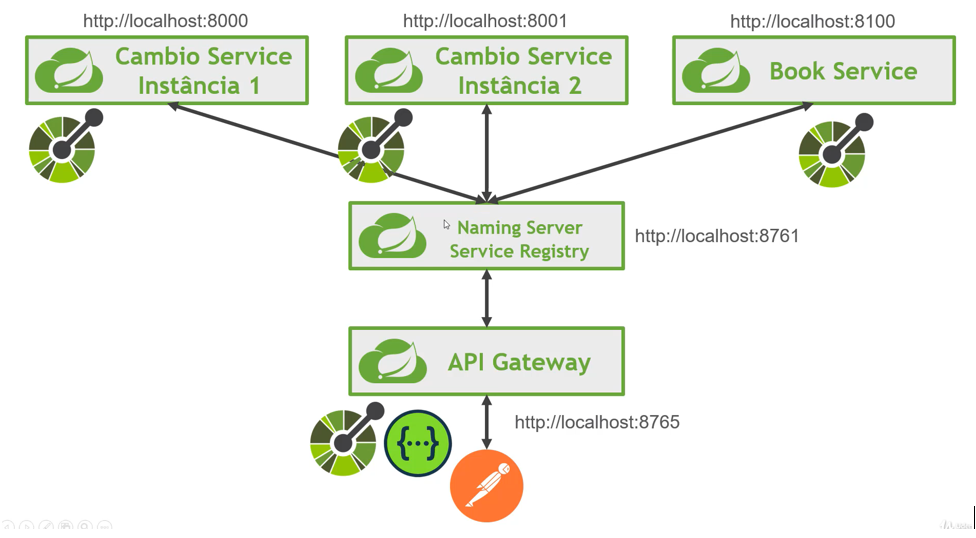
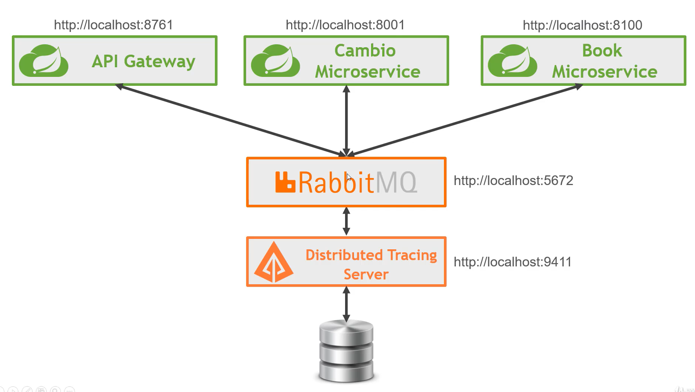

# microservices-basic

Uma arquitura simples de microserviço, onde é utilizado o Spring actuator, o flyway, o service discovery, o cloud api gateway, o resilience4j,o Swagger openapi, zipkin, eureka e sleuth.

